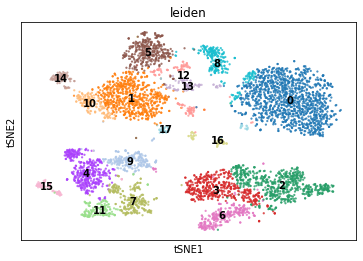
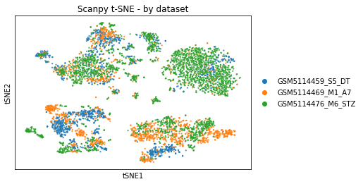
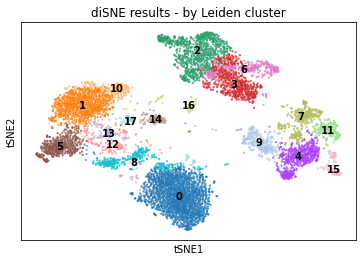
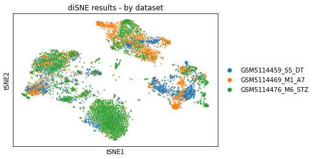

# diSNE
`diSNE` is a tool to perform t-SNE, t-distributed stochastic neighbor embedding, on a pre-filtered and clustered dataset. t-SNE aids with non-linear dimensionality reduction for high-dimensional data, making it applicable when analyzing single-cell RNA sequencing (scRNA-seq) data, as well as many other types of datasets.   
As a prerequisite, diSNE expects that the input dataset has been pre-processed as desired by the user, and that the Scanpy library has been used to perform Leiden clustering on the dataset. A full list of required packages can be found in `tests/requirements.txt`.   

For more information on t-SNE, visit [Laurens van der Maaten's website](https://lvdmaaten.github.io/tsne/).

# Install Instructions
## Prerequisites
Installation requires the `setuptools`, `pandas`, `numpy`, `scanpy`, `matplotlib`, `seaborn`, and `hdf5plugin` libraries to be installed. You can install these with `pip`:  
```
pip install setuptools pandas numpy scanpy matplotlib seaborn hdf5plugin
``` 

Once these libraries are installed, `diSNE` can be installed with the following commands:

`git clone https://github.com/TanviJain2803/di-SNE`

`cd ./di-SNE`

`python setup.py install`  OR

`pip install .` (from inside the `di-SNE` directory)  

Note: if you do not have root access, you can run the commands above with additional options to install locally:
```
pip install --user setuptools pandas numpy scanpy matplotlib seaborn hdf5plugin
python setup.py install --user
```

If the install was successful, the command `diSNE --help` should display a help message.  

Note: If the `diSNE` command was not found, you may need to include the script installation path in your $PATH. You can run `export PATH=$PATH:/home/$USER/.local/bin` at the command line to do so.

# Usage  
`diSNE [-options] data` 

To run `diSNE` on a small test example (using files in this repo), use the following command:  
```diSNE -g example_plot.png example-files/example_dataset.h5ad```  

This will run diSNE using the default options on the file `example_dataset.h5ad` included in the `example-files` folder, and will save the updated AnnData object with the t-SNE results to a new file called `diSNE-results.h5ad`, and a plot of the results to a file called `example_plot.png`. We include a plot of the example dataset that we generated as the file `reference-example.png` in the `example-files` folder for reference. Note that since t-SNE is a stochastic algorithm, results vary across runs and your graph may look slightly different than ours. Generally, you should expect to see three clusters of points on the plot.  

## Options  
The only required input to `diSNE` is a h5ad file, containing the AnnData object that represents your dataset, with Leiden clustering already performed on it. For more information on Scanpy's AnnData structure, visit [Scanpy's documentation](https://anndata.readthedocs.io/en/latest/tutorials/notebooks/getting-started.html). For more information on HDF5 file format, visit the [HDF5 documentation](https://portal.hdfgroup.org/documentation/). 

Any of the additional options below can be specified if desired:   
- `-o`, `--output`: Name of the file where the updated AnnData object with t-SNE results will be saved. File is saved as an h5ad file. By default, the file is called `diSNE-results.h5ad` and will be saved in your current working directory. For more information on the HDF5 file format, visit the [HDF5 documentation](https://portal.hdfgroup.org/documentation/).   

- `-P`, `--PCA`: **Can only be used if PCA has been run on the input AnnData object.** Uses reduced linear dimensions to optimize runtime.

- `-p`, `--perplexity`: Generally, perplexity can be thought of as a target number of neighbors for a point in the dataset (the higher the perplexity, the higher value of variance for that point). It typically ranges from around 5-50, and larger/denser datasets usually require a larger perplexity, but we suggest playing around with different perplexity values to see what visualizes your dataset most effectively.

- `-r`, `--learning-rate`: The learning rate controls the step size at each iteration during the optimization portion of t-SNE. The default value is 200, and recommended values range from 100-1000.
  
- `-T`, `--num-iterations`: This sets the number of iterations that optimization will run for. The default value is 1000.

- `-E`, `--early-exaggeration`: Early exaggeration is a constant that scales the original matrix of affinities in high-dimensional space. This emphasizes very similar points (high affinity values in the original high-dimensional space) in the lower-dimensional space earlier on, which will form 'clusters' of highly similar values. The default value is 4.

- `-g`, `--graph`: Name of the file where a plot of the t-SNE results will be saved. The plot is labeled by Leiden cluster.   
# Benchmarking Results
| Method used | Runtime (s) | Maximum Memory Usage (MiB)| Plot by Cluster | Plot by Dataset |
|-|-|-|-|-|
| Scanpy tsne | 22.36 | 787.70 |  | 
| diSNE tsne | 3634.49 | 2109.47 |  |   

# Contributors
This repository was generated by Nimrit Kaur, Tanvi Jain, and Kathryn Chen as a project for CSE 185 at UCSD, spring quarter 2024. We referenced a variety of resources, including [van der Maaten and Hinton's original t-SNE paper](https://jmlr.org/papers/v9/vandermaaten08a.html), the [SciKit Learn documentation](https://scikit-learn.org/stable/modules/manifold.html#t-sne), and other t-SNE examples/walkthroughs.
